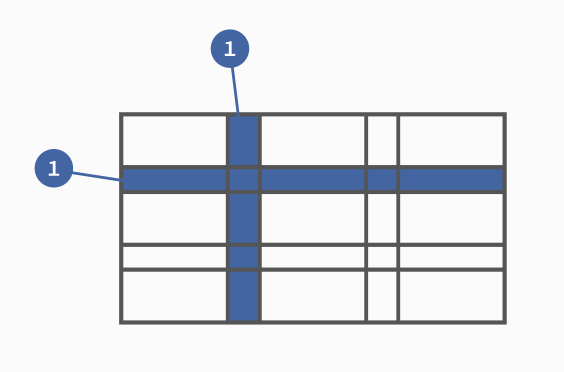
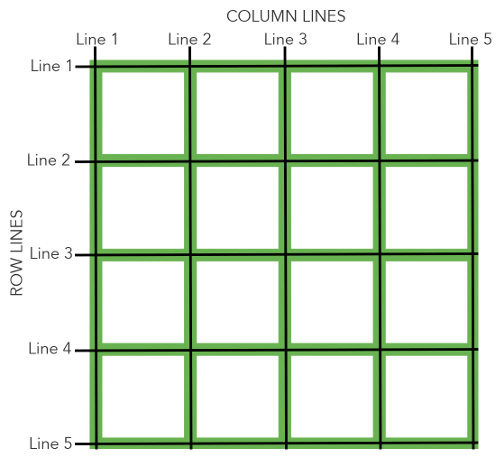

# 1. 基本概念

## 1.1 容器和项目(container / item)

采用网格布局的区域，称为"容器"（container）。容器内部采用网格定位的子元素，称为"项目"（item）。

```css
<div>
  <div><p>1</p></div>
  <div><p>2</p></div>
  <div><p>3</p></div>
</div>
```

上面代码中，最外层的<div>元素就是容器，内层的三个<div>元素就是项目。

注意：项目只能是容器的顶层子元素，不包含项目的子元素，比如上面代码的<p>元素就不是项目。Grid 布局只对项目生效。

## 1.2 行和列(row / column)



## 1.3 单元格(cell)

行和列的交叉区域，称为"单元格"（cell）。

正常情况下，n 行和 m 列会产生 n x m 个单元格。比如，3 行 3 列会产生 9 个单元格。

## 1.4 网格线(grid line)

正常情况下，n 行有 n + 1 根水平网格线，m 列有 m + 1 根垂直网格线，比如三行就有四根水平网格线。



# 2. 容器属性

| 属性                             | 选项                              | 含义                                                    | 注意项                                                                                                                                |
| :------------------------------- | --------------------------------- | ------------------------------------------------------- | ------------------------------------------------------------------------------------------------------------------------------------- | ------------------------------------------ | ---------------------------------------------------------------- | ------------- | ------------------------------------------ | ------------------------------------------------------------------------------------------------------------------------------- | ---------------- | --- |
| display                          | grid \| inline-grid               | 指定一个容器采用网格布局。                              | 设为网格布局以后，容器子元素（项目）的 float、display: inline-block、display: table-cell、vertical-align 和 column-\*等设置都将失效。 |
| grid-template-columns            | px \| %                           | fr                                                      | minmax(min, max)                                                                                                                      | auto                                       | repeat(n                                                         | auto-fill, px | %                                          | fr ...)                                                                                                                         | 定义每一行的列宽 | /   |
| grid-template-rows               | px \| %                           | fr                                                      | minmax(min, max)                                                                                                                      | auto                                       | repeat(n                                                         | auto-fill, px | %                                          | fr ...)                                                                                                                         | 定义每一行的行高 | /   |
| grid-row-gap                     | px                                | 设置行与行的间隔（行间距）                              | grip-可省略，写作 row-gap                                                                                                             |
| grid-column-gap                  | px                                | 设置列与列的间隔（列间距）                              | grip-可省略，写作 column-gap                                                                                                          |
| grid-gap                         | <grid-row-gap> <grid-column-gap>  | grid-column-gap 和 grid-row-gap 的合并简写形式          | grip-可省略，写作 gap                                                                                                                 |
| grid-template-areas              |                                   | 用于定义区域，一个区域由单个或多个单元格组成            | 不常用                                                                                                                                |
| grid-auto-flow                   | row \| column                     | row dense                                               | column dense                                                                                                                          | 指定子元素默认排序规则，按行排序或按列排序 | dense 值主要用于，某些项目指定位置以后，剩下的项目怎么自动放置。 |
| justify-items                    | start \| end                      | center                                                  | stretch                                                                                                                               | 设置单元格内容的水平位置（左中右）         | stretch：拉伸，占满单元格的整个宽度（默认值）。                  |
| align-items                      | start \| end                      | center                                                  | stretch                                                                                                                               | 设置单元格内容的垂直位置（上中下）         |                                                                  |
| place-items                      | <align-items> <justify-items>     | align-items 属性和 justify-items 属性的合并简写形式     |                                                                                                                                       |
| justify-content                  | start \| end                      | center                                                  | stretch                                                                                                                               | space-around                               | space-between                                                    | space-evenly  | 整个内容区域在容器里面的水平位置（左中右） |                                                                                                                                 |
| align-content                    | start \| end                      | center                                                  | stretch                                                                                                                               | space-around                               | space-between                                                    | space-evenly  | 整个内容区域的垂直位置（上中下）           | stretch - 项目大小没有指定时，拉伸占据整个网格容器; space-evenly - 项目与项目的间隔相等，项目与容器边框之间也是同样长度的间隔。 |
| place-content                    | <align-content> <justify-content> | align-content 属性和 justify-content 属性的合并简写形式 |                                                                                                                                       |
| grid-auto-columns/grid-auto-rows |                                   | 用来设置，浏览器自动创建的多余网格的列宽和行高。        | 它们的写法与 grid-template-columns 和 grid-template-rows 完全相同。                                                                   |

# 3. 容器属性

| 属性                                                               | 选项                                            | 含义                                                        | 注意项                                                                         |
| ------------------------------------------------------------------ | ----------------------------------------------- | ----------------------------------------------------------- | ------------------------------------------------------------------------------ | ----------------------------------------------------------------------------- | ------------------- |
| grid-column-start / grid-column-end /grid-row-start / grid-row-end | number: 网格线的序号，从 1 开始 \| 网格线的名字 | span number：跨越，即左右边框（上下边框）之间跨越多少个网格 | 项目的位置是可以指定的，具体方法就是指定项目的四个边框，分别定位在哪根网格线。 | 使用这四个属性，如果产生了项目的重叠，则使用 z-index 属性指定项目的重叠顺序。 |
| grid-column                                                        |                                                 | grid-column-start 和 grid-column-end 的合并简写形式         |                                                                                |
| grid-row                                                           |                                                 | grid-row-start 属性和 grid-row-end 的合并简写形式。         |                                                                                |
| justify-self / align-self / place-self                             | start \| end                                    | center                                                      | stretch                                                                        | 单元格内容的水平位置（左中右）/ 垂直位置（上中下）                            | place-self 两者缩写 |
